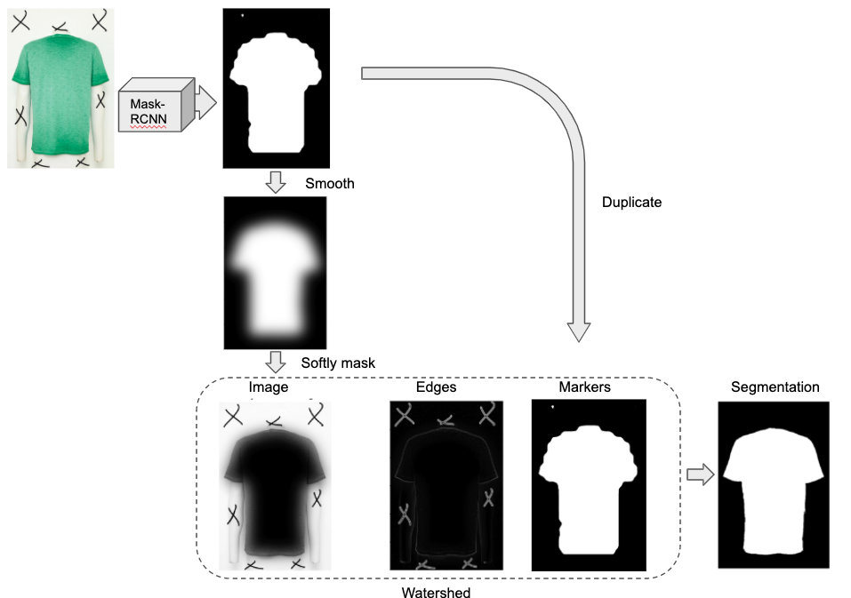

# Image segmentation for product images
This repository contains the codes to segment a raw images taken at the photo studio.  

## Getting Started:
[boosted_segmentation.py](./examples/boosted_segmentation.py) 
gives you the basic example to start with.

### Prerequisites
1. [The mask-rcnn inplementation](https://github.com/matterport/Mask_RCNN/blob/master/requirements.txt)
2. A pretrained mask-rcnn model
3. See `requirements.txt`  

### Installing
```buildoutcfg
git clone https://github.com/ZhichaoZhong/image-segmentation.git
cd image-segmentation
pip install -e .
```
Or
```buildoutcfg
pip install git+https://github.com/ZhichaoZhong/image-segmentation.git
```
## Boosted segmentation method
#### Semantic segmentation task
This library can be used to perform a simple semantic segmentation task: given a high-resolution natural photo of a 
clothing, segment the clothing instance from the background. Below is an example:  

  
#### Mask-rcnn
One of the state-of-the-art techniques is to [use neural-network models](https://arxiv.org/pdf/1809.10198.pdf). In our 
case, we trained a [mask-rcnn](https://github.com/matterport/Mask_RCNN) model on our own dateset. The mask-rcnn model 
generalizes very well on different images. However, the final output mask is not highly accurate. It is interpolated from 
a 28X28 feature map, which resolution is very low compared the resolution of the image (2400X1600). The size of the 
feature map can be increased to 56X56, or even 112X112, but hardly higher due to the limitation of GPU memory.    

  
#### Watershed
We looked at some [segmentation techniques](https://scikit-image.org/docs/dev/api/skimage.segmentation.html) that can 
potentially perform well on high resolution image. Among them, we found the 
[watershed approach](https://scikit-image.org/docs/dev/user_guide/tutorial_segmentation.html) most interesting. 
The watershed approach can be summarized as three steps:  
1. Detect the edges using image filters (e.g. Sobel, Laplace).
2. Label markers as foreground and background (e.g. using thresholds). 
3. Flood the markers till reaching the edges.
Here is an example:  

The watershed approach is straightforward, and performs well on the edges by nature. However, it is difficult to label 
the markers in an automatic manner. Also, the edges inside instance to be segmented can be troublesome. 
Below is a bad example:

 
#### The boosted approach
The boosted approach dedicates itself to compensate the drawbacks of both approach. It can be summarized as the 
following procedures:
1. Generate a mrcnn-mask using the mask-rcnn model.  
2. Softly mask the image to make the object edges dominant (by masking the interiors).  
3. Use the mrcnn mask as the markers.  
4. Apply the watershed algorithms on the softly-masked image.  
This image describes the boosted approach the best:


## Benchmark
ToDo
## ToDo:
1. [x] Merge the two-soft branch to master 
2. [x] Edit the example notebooks
3. [x] Finish the readme:  
    a. Descriptions  
    b. Explain the algorithm  
    c. Include examples 
    d. Benchmark (ToDo)  
4. [X] add requirements.txt